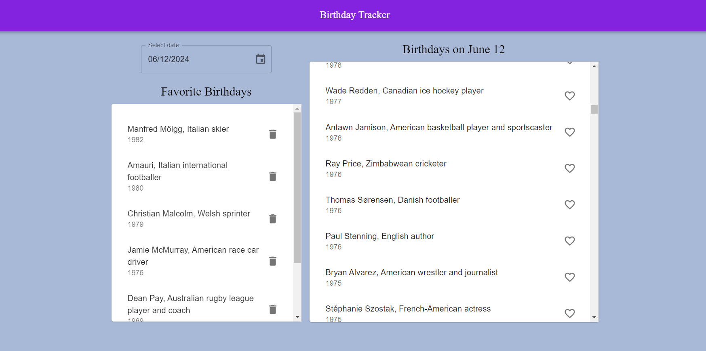

# Title: "Birthday Tracker"

Description: |
  Birthday Tracker is a React web application that allows users to track birthdays of famous personalities and mark their favorite birthdays.

Features:
  - Select a date to view famous birthdays on that day.
  - Mark birthdays as favorites to easily keep track of them.
  - View and manage your list of favorite birthdays.
  - Automatically saves favorite birthdays using local storage.

Technologies_used:
  - React
  - Material-UI
  - Day.js
  - Wikimedia API

Installation:
  - Clone the repository:
    ```bash
    git clone https://github.com/your-username/birthday-tracker.git
    ```
  - Navigate into the project directory:
    ```bash
    cd birthday-tracker
    ```
  - Install dependencies:
    ```bash
    npm install
    ```
  - Start the development server:
    ```bash
    npm start
    ```

# usage:
  - Select a date using the date picker to view birthdays of famous personalities on that day.
  - Click on the heart icon next to a birthday to mark it as a favorite.
  - View your list of favorite birthdays in the "Favorite Birthdays" section.
  - Click on the trash icon to remove a birthday from your favorites list.


# screenshots:
  - url: ""
    description: "Screenshot 1"
